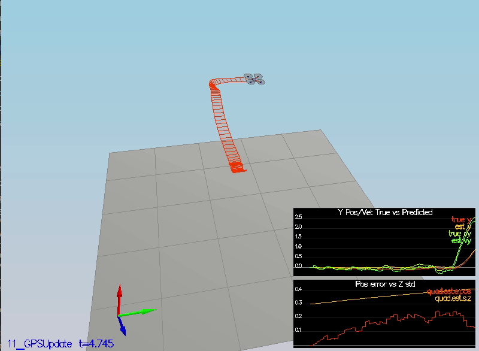

# EKF Estimator for Drone #

Welcome to the EKF estimation for Drone project. This is the forth and last project in Aerial Vehicle Engineer NanoDegree program at Udacity. 
In this project, I have developed the estimation portion of the controller used in the CPP simulator.  
By the end of the project, I have simulated quad which is flying with your estimator and my custom controller (from the previous project)!

<pre align="center"></pre>

This README is broken down into the following sections:

 - [Setup](#setup) - the environment and code setup required to get started and a brief overview of the project structure
 - [The Tasks](#the-tasks) - the tasks you will need to complete for the project
 - [Contributor](#Contributors) - Thank note for initial developers.
 


## Setup ##

This project will continue to use the C++ development environment you set up in the Controls C++ project.

 1. Clone the repository
 ```
 git clone https://github.com/Ashutosh-Badave/EKF_estimator_for_Drone.git
 ```

 2. Import the code into IDE like done in the [Controls C++ project](https://github.com/Ashutosh-Badave/Controller_for_drone#development-environment-setup)
 
 3. You should now be able to compile and run the estimation simulator just as explained in the controls project


### Project Structure ###

For this project,

 - The EKF is implemented in `QuadEstimatorEKF.cpp`

 - Parameters for tuning the EKF are in the parameter file `QuadEstimatorEKF.txt`

 - When you turn on various sensors (the scenarios configure them, e.g. `Quad.Sensors += SimIMU, SimMag, SimGPS`), additional sensor plots will become available to see what the simulated sensors measure.

 - The EKF implementation exposes both the estimated state and a number of additional variables. In particular:

   - `Quad.Est.E.X` is the error in estimated X position from true value.  More generally, the variables in `<vehicle>.Est.E.*` are relative errors, though some are combined errors (e.g. MaxEuler).

   - `Quad.Est.S.X` is the estimated standard deviation of the X state (that is, the square root of the appropriate diagonal variable in the covariance matrix). More generally, the variables in `<vehicle>.Est.S.*` are standard deviations calculated from the estimator state covariance matrix.

   - `Quad.Est.D` contains miscellaneous additional debug variables useful in diagnosing the filter. You may or might not find these useful but they were helpful to us in verifying the filter and may give you some ideas if you hit a block.


#### `config` Directory ####

In the `config` directory, in addition to finding the configuration files for controller and estimator, you will also see configuration files for each of the simulations.  For this project, I have worked with simulations 06 through 11 and you may find it insightful to take a look at the configuration for the simulation.

As an example, if we look through the configuration file for scenario 07, we see the following parameters controlling the sensor:

```
# Sensors
Quad.Sensors = SimIMU
# use a perfect IMU
SimIMU.AccelStd = 0,0,0
SimIMU.GyroStd = 0,0,0
```

This configuration tells us that the simulator is only using an IMU and the sensor data will have no noise.  You will notice that for each simulator these parameters will change slightly as additional sensors are being used and the noise behavior of the sensors change.


## The Tasks ##

Once again, I have developed my estimator in pieces.  How I completed those steps and successfully designed estimator is explained in [writeup file](Writeup.md)

## Contributors ##

Thanks to Udacity and Fotokite for the initial development of the project code and simulator.