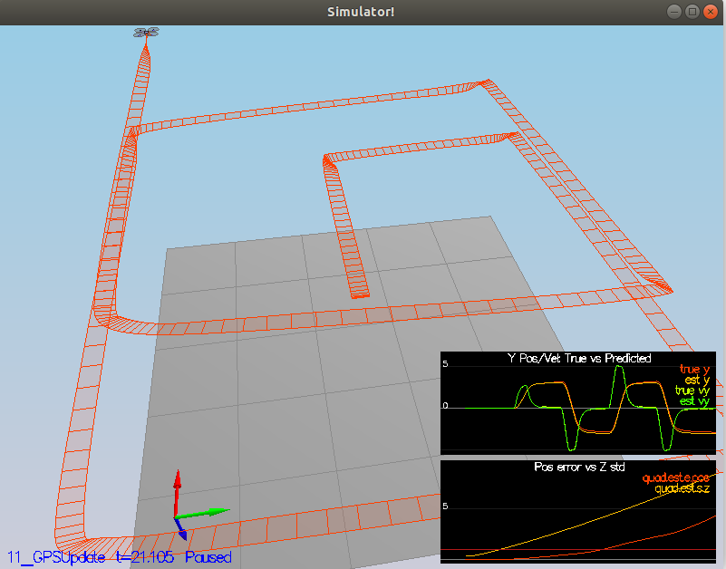

# Steps of implementation #
Below I have explained how I tackled all the points, implemented the code and tuned the parameters for better performance.

Outline:

- [Step 1: Sensor Noise](#1-Sensor-noise)
- [Step 2: Attitude Estimation](#2-Attitude-Estimation)
- [Step 3: Prediction Step](#3-Prediction-step)
- [Step 4: Magnetometer Update](#4-Magnetometer-Update)
- [Step 5: Closed Loop + GPS Update](#5-Closed-Loop-and-GPS-Update)
- [Step 6: Adding my PID Controller](#6-Adding-my-PID-Controller)

### 1 Sensor noise ###
1. Started running the simulator with senario 6_noisysensors. 
2. Recorded the GPS and Accelerometer data in graph1 and graph2 files respectively.
3. Calculated the mean and standard deviation using below mathematical formulas:
<pre>
<math>
mean = Sum of all points / No of points
Std_dev = pow(sum(pow(point -mean,2))/N,0.5)
</math>
</pre>
4. changed the values of `MeasuredStdDev_GPSPosXY` and `MeasuredStdDev_AccelXY` in `config/6_Sensornoise.txt`.
5. After running the simulator again, graphs turned green after few sec and results were passed.

### 2 Attitude Estimation ###
Used the quaternion class as per suggested and took help from section 7.2.1 Nonliear Complementary Filter of 
[Estimation for Quadrotors](https://www.overleaf.com/read/vymfngphcccj). Below is code snippet:  

<pre><code>
  Quaternion qt_bar = Quaternion::FromEuler123_RPY(rollEst,pitchEst,ekfState(6));
  qt_bar.IntegrateBodyRate(gyro,dtIMU);

  float predictedPitch = qt_bar.Pitch();
  float predictedRoll = qt_bar.Roll();
  ekfState(6) = qt_bar.Yaw();

</code>
</pre>

### 3 Prediction step ###
I have implemented the code as per explained in section 7.2 of [Estimation for Quadrotors](https://www.overleaf.com/read/vymfngphcccj).
1. I have rotated attitude using accel and saved in matrix and then prediction state is calculated as below:

<pre>
<code>
V3F Acc_mat = attitude.Rotate_BtoI(accel);
    predictedState[0] = curState[0] + dt * curState[3];
    predictedState[1] = curState[1] + dt * curState[4];
    predictedState[2] = curState[2] + dt * curState[5];
    predictedState[3] = curState[3] + dt * Acc_mat[0];
    predictedState[4] = curState[4] + dt * Acc_mat[1];
    predictedState[5] = curState[5] + dt * Acc_mat[2] - dt * 9.81f;
    
</code>
</pre>

2. Modified  `Predict()` function by Creating helping matrix and jacobian as per equation provided in section 7.2.

<pre>
<code>
    gPrime(0, 3) = dt;
    gPrime(1, 4) = dt;
    gPrime(2, 5) = dt;

    VectorXf u(3);
    u << accel.x, accel.y, accel.z;

    VectorXf sub_vec(3);
    sub_vec = RbgPrime * u * dt;

    gPrime(3, 6) = sub_vec(0);
    gPrime(4, 6) = sub_vec(1);
    gPrime(5, 6) = sub_vec(2);

    ekfCov = gPrime * ekfCov * gPrime.transpose() + Q; // Prediction of covariance matrix

</code>
</pre>

3. Tuned QPosXYStd and QVelXYStd for better results.

### 4 Magnetometer Update ###
1. After running the realistic IMU scenario`10_MagUpdate`, without magnetometer update, estimated yaw was drifting away.
For better performance I tuned QYawStd to 0.065. But still no great results.
2. Furthermore, I have implemented `UpdateFromMag()``function, by considering the difference of estimated yaw and measured yaw. 
Done the normalization of difference and updated the yaw value as shown below:

<pre><code>
    // Current estimated yaw
    zFromX(0) = ekfState(6);

    // Update the hprime
    hPrime(6) = 1.0f;

    // difference of yaw
    MatrixXf Yaw_diff = z - zFromX;

    // normalize yaw to -pi .. pi
    if (Yaw_diff(0) > F_PI) z(0) -= 2.f * F_PI;
    if (Yaw_diff(0) < -F_PI) z(0) += 2.f * F_PI;
</code></pre>

3. Again done the tuning of QYawStd to 0.065 which provided better results similar to below:

### 5 Closed Loop and GPS Update ###

1. After removing idealEstimator and before implementation of GPS update function.

2. Then, I have removed simulated IMU and considered realtime IMU, before tuning process noise, which changed the flight path drastically 
as shown below:

3. To make it work, firstly I have implemented GPS measurement function by taking reference of equations provided 
in section 7.3.1 in [Estimation for Quadrotors](https://www.overleaf.com/read/vymfngphcccj).

4. Also tuned the process noise model again for better performance of drone, which shown below:

<pre align="center"></pre>

### 6 Adding my PID Controller ###
I have added my own developed PID controller for quad , also added the configparam file and tested the estimator output.
It has provided the same results without changing anything.